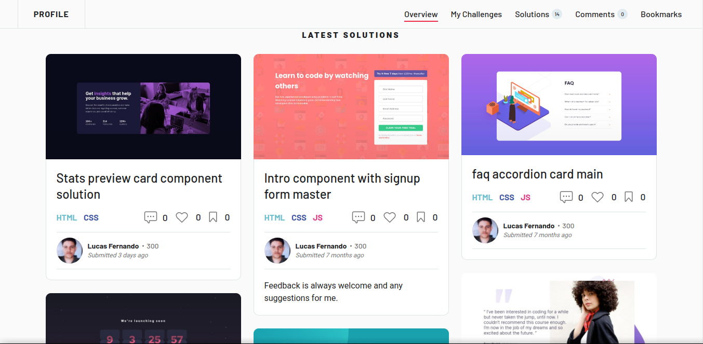

# Frontend Mentor - Projetos

Esse é um repositórios agrupando todos os meus desafios do Frontend Mentor.

 

## 🍃 O que é Frontend Mentor?

O Frontend Mentor é uma plataforma que possibilita desenvolvedores a ganhar experiência
no desenvolvimento web, por desafios front-end que incluem web designs profissionais. Isso permite que você pratique a construção de sites em um fluxo de trabalho realista. Aceitar esses desafios ajudará você a melhorar suas habilidades, ganhar experiência na criação de sites e criar um portfólio de projetos incrível.

<a href="https://www.frontendmentor.io/" target="_blank">Visitar Frontend Mentor →</a>

 

## ⚡ Tecnologias

- HTML
- CSS
- Javascript
- ReactJS
- Typescript
- Styled Components

## ⚔️ Projetos

| Nível         |            |
| ------------- | ---------- |
| Novato        | 🔥         |
| Júnior        | 🔥🔥       |
| Intermediário | 🔥🔥🔥     |
| Avançado      | 🔥🔥🔥🔥   |
| Guru          | 🔥🔥🔥🔥🔥 |

| Titulo                                                     | Nível    | Tecnologias                             | Visualizar                                                                                                                        |
| ---------------------------------------------------------- | -------- | --------------------------------------- | --------------------------------------------------------------------------------------------------------------------------------- |
| QR code component                                          | 🔥       | HTML · CSS                              | <a href="https://lucasfernandodev.github.io/frontendmentor/challenges/qr-code-component-main/">Ver</a>                            |
| 3 column preview card component                            | 🔥       | HTML · CSS                              | <a href="https://lucasfernandodev.github.io/frontendmentor/challenges/3-column-preview-card-component-main/">Ver</a>              |
| NFT preview card component                                 | 🔥       | HTML · CSS                              | <a href="https://lucasfernandodev.github.io/frontendmentor/challenges/nft-preview-card-component-main">Ver</a>                    |
| Article preview component                                  | 🔥       | HTML · CSS                              | <a href="https://lucasfernandodev.github.io/frontendmentor/challenges/article-preview-component-master">Ver</a>                   |
| Order summary component                                    | 🔥       | HTML · CSS                              | <a href="https://lucasfernandodev.github.io/frontendmentor/challenges/order-summary-component-main">Ver</a>                       |
| Base Apparel coming soon page                              | 🔥       | HTML · CSS · JS                         | <a href="https://lucasfernandodev.github.io/frontendmentor/challenges/base-apparel">Ver</a>                                       |
| Ping single column coming soon page                        | 🔥       | HTML · CSS · JS                         | <a href="https://lucasfernandodev.github.io/frontendmentor/challenges/single-price-grid-component-master">Ver</a>                 |
| FAQ accordion card                                         | 🔥       | HTML · CSS · JS                         | <a href="https://lucasfernandodev.github.io/frontendmentor/challenges/faq-accordion-card">Ver</a>                                 |
| Profile card component                                     | 🔥       | HTML · CSS                              | <a href="https://lucasfernandodev.github.io/frontendmentor/challenges/profile-card">Ver</a>                                       |
| Four card feature section                                  | 🔥       | HTML · CSS                              | <a href="https://lucasfernandodev.github.io/frontendmentor/challenges/four-card-feature-section-master ">Ver</a>                  |
| single price grid component                                | 🔥       | HTML · CSS                              | <a href="https://lucasfernandodev.github.io/frontendmentor/challenges/single-price-grid-component-master">Ver</a>                 |
| huddle single introductory section                         | 🔥       | HTML · CSS                              | <a href="https://lucasfernandodev.github.io/frontendmentor/challenges/huddle-single-introductory-section">Ver</a>                 |
| Social proof section                                       | 🔥       | HTML · CSS                              | <a href="https://lucasfernandodev.github.io/frontendmentor/challenges/social-proof-section-master">Ver</a>                        |
| Intro component with sign-up form                          | 🔥       | HTML · CSS                              | <a href="https://lucasfernandodev.github.io/frontendmentor/challenges/intro-component-with-signup-form-master">Ver</a>            |
| Stats preview card component                               | 🔥       | HTML · CSS                              | <a href="https://lucasfernandodev.github.io/frontendmentor/challenges/stats-preview-card">Ver</a>                                 |
| Time tracking dashboard                                    | 🔥🔥     | HTML · CSS · JS                         | <a href="https://lucasfernandodev.github.io/frontendmentor/challenges/time-tracking-dashboard-main">Ver</a>                       |
| E-commerce product page                                    | 🔥🔥🔥   | HTML · CSS · JS · React.js · Typescript | <a href="https://sneakears.netlify.app">Ver</a>                                                                                   |
| Chat app CSS illustration                                  | 🔥🔥🔥   | HTML · CSS · JS                         | <a href="https://lucasfernandodev.github.io/frontendmentor/challenges/chat-app-css-illustration-master/">Ver</a>                  |
| Todo app solution                                          | 🔥🔥🔥   | HTML · CSS · JS                         | <a href="https://lucasfernandodev.github.io/frontendmentor/challenges/todo-app-main/">Ver</a>                                     |
| Sunnyside agency landing page                              | 🔥🔥     | HTML · CSS · JS                         | <a href="https://lucasfernandodev.github.io/frontendmentor/challenges/sunnyside-agency-landing-page-main/">Ver</a>                |
| Fylo data storage component                                | 🔥🔥     | HTML · CSS                              | <a href="https://lucasfernandodev.github.io/frontendmentor/challenges/fylo-data-storage-component-master">Ver</a>                 |
| Advice generator app challenge hub                         | 🔥🔥     | React.js · Typescript · API             | <a href="https://lucasfernandodev-adviceapi.netlify.app/">Ver</a>                                                                 |
| REST Countries API with color theme switcher challenge hub | 🔥🔥🔥🔥 | React.js · Typescript                   | <a href="https://frontendmentor-lucasfernandodev.vercel.app/">Ver</a>                                                             |
| Tip calculator app                                         | 🔥🔥     | HTML · CSS ·JS                          | <a href="https://lucasfernandodev.github.io/frontendmentor/challenges/tip-calculator-app-main/">Ver</a>                           |
| Animate Interactive rating component                       | 🔥       | HTML · CSS ·JS                          | <a href="https://lucasfernandodev.github.io/frontendmentor/challenges/interactive-rating-component-main/">Ver</a>                 |
| Space tourism multi-page website                           | 🔥🔥🔥   | React.js · Typescript · Vite            | <a href="https://lucasfernandodev.github.io/spacetravel/">Ver</a>                                                                 |
| Interactive card details form                              | 🔥🔥     | HTML · CSS · JS                         | <a href="https://lucasfernandodev.github.io/frontendmentor/challenges/interactive-card-details-form-main/">Ver</a>                |
| Product preview card component                             | 🔥       | HTML · CSS                              | <a href="https://lucasfernandodev.github.io/frontendmentor/challenges/product-preview-card-component-main/">Ver</a>               |
| Pricing component with toggle                              | 🔥🔥     | HTML · CSS · JS                         | <a href="https://lucasfernandodev.github.io/frontendmentor/challenges/pricing-component-with-toggle-master/">Ver</a>              |
| Social media dashboard with theme switcher                 | 🔥🔥     | HTML · CSS · JS                         | <a href="https://lucasfernandodev.github.io/frontendmentor/challenges/social-media-dashboard-with-theme-switcher-master/">Ver</a> |
| Coding bootcamp testimonials slider                        | 🔥🔥     | HTML · CSS · JS                         | <a href="https://lucasfernandodev.github.io/frontendmentor/challenges/coding-bootcamp-testimonials-slider-master/">Ver</a>        |
| Project tracking intro component                           | 🔥🔥     | HTML · CSS · JS                         | <a href="https://lucasfernandodev.github.io/frontendmentor/challenges/project-tracking-intro-component-master/">Ver</a>           |
| Notifications page                                         | 🔥🔥     | HTML · CSS · JS                         | <a href="https://lucasfernandodev.github.io/frontendmentor/challenges/notifications-page-main/">Ver</a>                           |
| Shortly URL shortening API Challenge                       | 🔥🔥🔥   | HTML · CSS · JS                         | <a href="https://lucasfernandodev.github.io/frontendmentor/challenges/url-shortening-api-master/">Ver</a>                         |
| Multi-step form solution                                   | 🔥🔥🔥   | React · Typescript · Vite               | <a href="https://frontendmentor-3z71.vercel.app/">Ver</a>                                                                         |
| Intro section with dropdown navigation                     | 🔥🔥     | HTML · CSS · JS                         | <a href="https://lucasfernandodev.github.io/frontendmentor/challenges/intro-section-with-dropdown-navigation-main/">Ver</a>       |

## 🌎 Me Encontre

